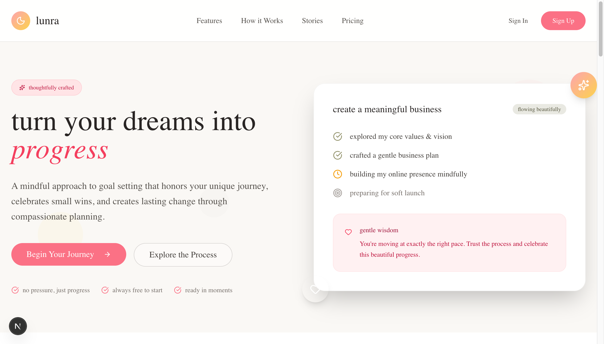
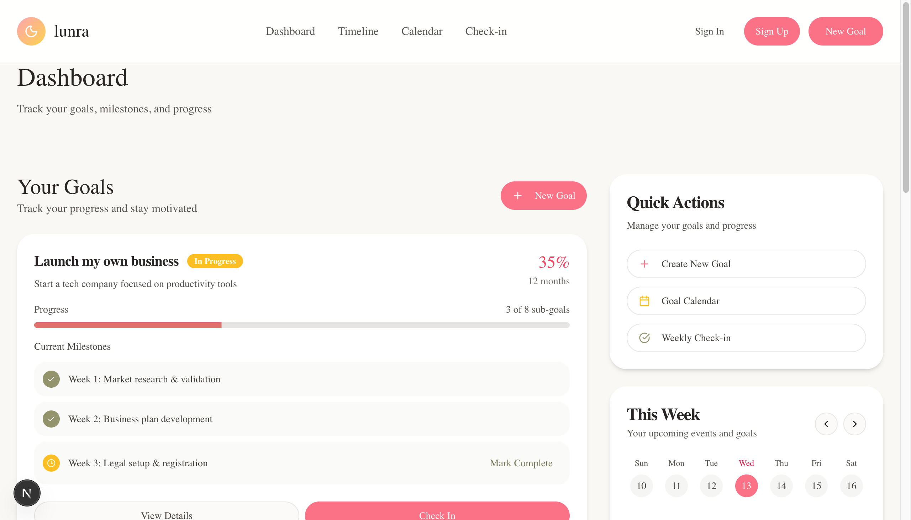
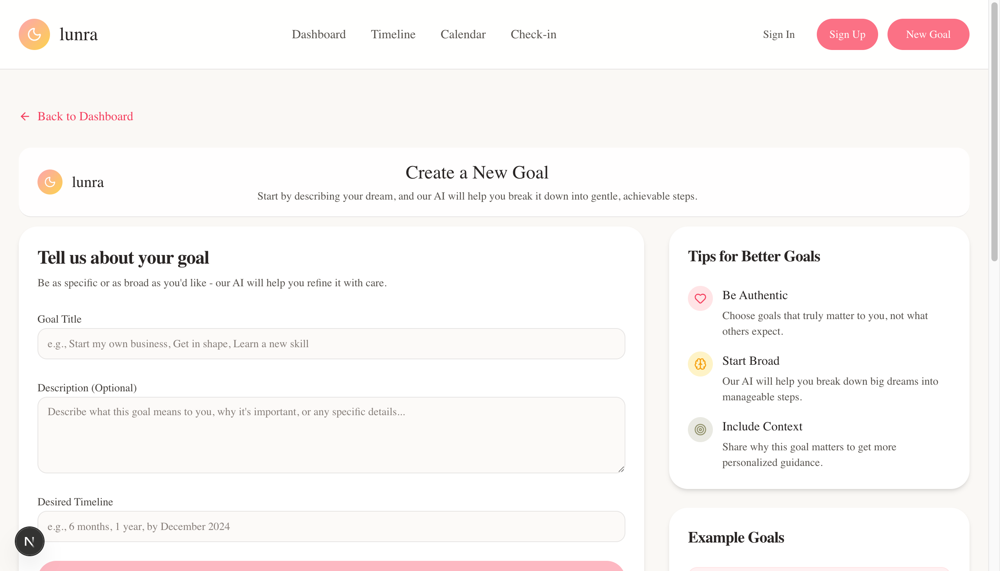
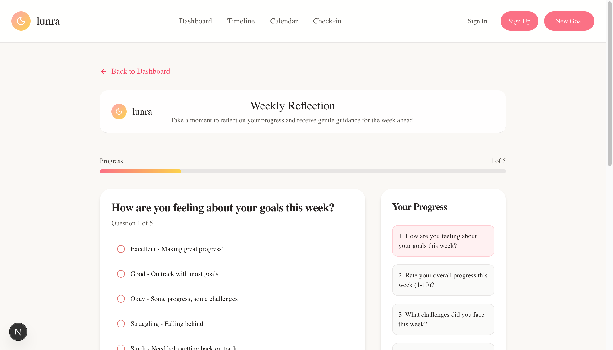
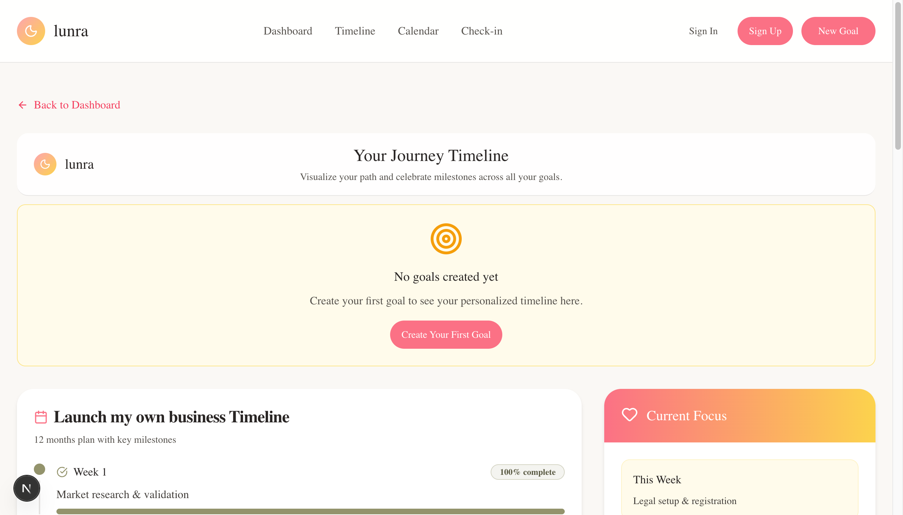

# Lunra

Production-ready AI goal planning app using Next.js, Supabase, and Stripe.



## Screenshots

### Dashboard


### Create a Goal


### Weekly Check-in


### Timeline View


## Documentation

- Start here: `docs/README.md`
- Contribution guidelines: `docs/CONTRIBUTING.md`

## Local Development

```bash
pnpm install
cp env.example .env.local
pnpm dev
```

Environment variables and setup are documented in `docs/README.md`.
